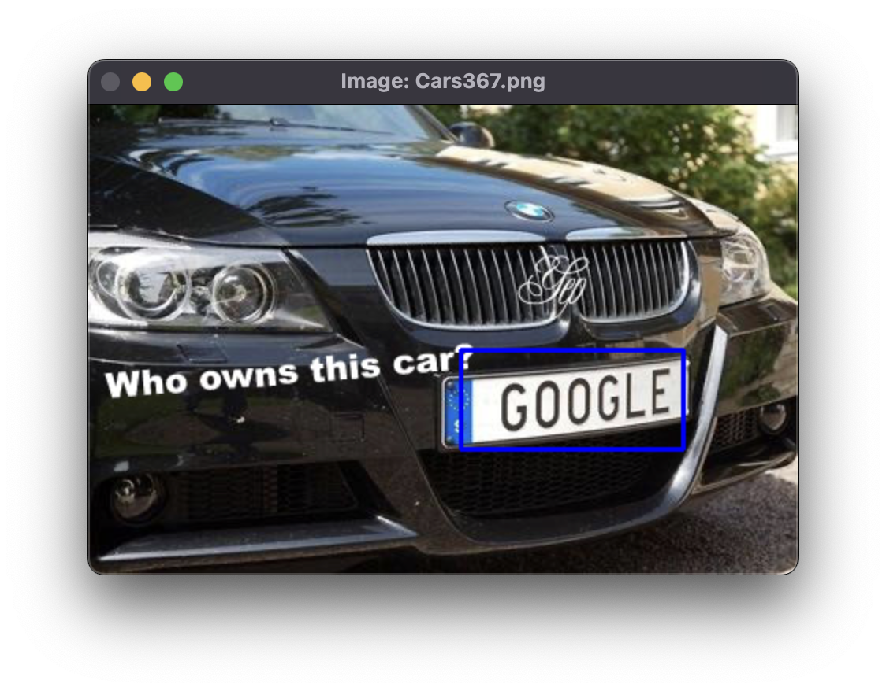

# CNN based Bounding Box Regression

This project is an end to end implementation of a CNN based bounding box regression technique for detection of
Automobile license plates.

The model developed is a very simple and linear model which has a series of Convolution and Pooling layers 
applied sequentially in order to understand the theoretical concepts behind the CNNs and visualize the practical 
performance on a real world use case. 

### Model Summary:

customNN(\
  (conv1): Conv2d(3, 32, kernel_size=(3, 3), stride=(1, 1), padding=(1, 1)) \
  (pool): MaxPool2d(kernel_size=2, stride=2, padding=0, dilation=1, ceil_mode=False)\
  (conv2): Conv2d(32, 64, kernel_size=(3, 3), stride=(1, 1), padding=(1, 1))\
  (conv3): Conv2d(64, 64, kernel_size=(3, 3), stride=(1, 1), padding=(1, 1))\
  (conv4): Conv2d(64, 64, kernel_size=(3, 3), stride=(1, 1), padding=(1, 1))\
  (conv5): Conv2d(64, 64, kernel_size=(3, 3), stride=(1, 1), padding=(1, 1))\
  (fc1): Linear(in_features=2048, out_features=512, bias=True)\
  (fc2_bbox): Linear(in_features=512, out_features=4, bias=True)\
  (fc2_score): Linear(in_features=512, out_features=1, bias=True)\
)

### Training Pipeline

All training and test data has to be saved under the folder **data**. The annotations can be either in XML format or
 a json file. The data is picked up automatically from this folder and preprocessed. All the original images
gathered should be saved under the path **data/images**.

Once the data is prepared accordingly, run the **train.py** file for starting the training 
process. There is also a provision to annotate the image files if in case the annotations 
are absent. 

### Sample Output:

